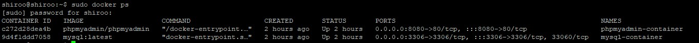
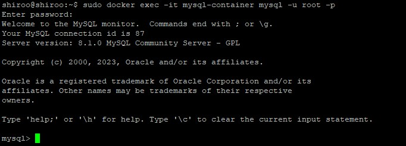

# docker-tutorial  
## instalasi docker di ubuntu server  
Install Dependensi untuk Menggunakan Repository HTTPS :
```
sudo apt install apt-transport-https ca-certificates curl software-properties-common
```
Tambahkan GPG Key Docker Repository :
```
curl -fsSL https://download.docker.com/linux/ubuntu/gpg | sudo gpg --dearmor -o /usr/share/keyrings/docker-archive-keyring.gpg
```
Tambahkan Docker Repository ke daftar repository APT :
```
echo "deb [arch=amd64 signed-by=/usr/share/keyrings/docker-archive-keyring.gpg] https://download.docker.com/linux/ubuntu $(lsb_release -cs) stable" | sudo tee /etc/apt/sources.list.d/docker.list > /dev/null
```
Setelah itu baru Install Docker :
```
sudo apt install docker-ce docker-ce-cli containerd.io
```
Aktfikan docker :
```
sudo systemctl start docker
```
Enable kan docker :
```
sudo systemctl enable docker
```
periksa apakah docker sudah terinstall atau belum :
```
sudo docker --version
```
Tambahkan pengguna ke dalam docker :
```
sudo usermod -aG docker shiroo
```
ganti `shiroo` dengan nama yang sesuai dengan ubuntu server anda, untuk memudahkan  

## Instalasi mysql didalam docker  
Pull Image MySQL dari docker hub :
```
sudo docker pull mysql:latest
```
Buat Container MySQL :
```
sudo docker run --name mysql-container -e MYSQL_ROOT_PASSWORD=root -d -p 3306:3306 mysql:latest
```
--name mysql-container: Memberi nama container.  
-e MYSQL_ROOT_PASSWORD=root: Mengatur kata sandi root MySQL.    
-d: Menjalankan container dalam mode latar belakang (daemon).  
-p 3306:3306: Mengarahkan port 3306 dari server Anda ke port 3306 dalam container MySQL. Ini adalah port default MySQL.  
periksa Instalasi MySQL :
```
sudo docker ps
```

masuk ke mysql yang ada di docker :
```
sudo docker exec -it mysql-container mysql -u root -p
```
masukan password yang tadi sudah di atur. jika sudah masuk maka tampilanya akan menjadi seperti ini :


## instalasi phpmyadmin  
pull image phpmyadmin dari docker hub :
```
sudo docker pull phpmyadmin/phpmyadmin
```
buat container phpmyadmin :
```
docker run -d --name phpmyadmin-container -e PMA_HOST=192.168.0.103 -e PMA_PORT=3306 -p 8080:80 phpmyadmin/phpmyadmin
```
`PMA_HOST=192.168.0.103` masukan ip dari ubuntu server anda. setalah itu coba jalankan `192.168.0.103:8080`
